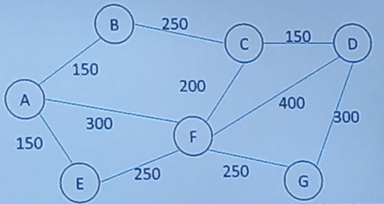

## Se tienen los datos de un grupo de 5 transacciones referentes a las matrículas de un grupo de estudiantes (código, apellidos, nombres, créditos), almacenadas como txt, crear un arreglo con estas transacciones y a partir del mismo, calcular cuántos estudiantes y su número de créditos matriculados, tienen un mayor número de créditos matriculados que el promedio de todos los estudiantes; generando esta respuesta en una tupla.
-----------------------------------------------------------------------------------------
## import numpy as np

## Definir el número de nodos en el grafo
num_nodos = 10

## Crear una matriz de adyacencia vacía con todos los valores en cero
matriz_adyacencia = np.zeros((num_nodos, num_nodos), dtype=int)

## Establecer conexiones entre nodos (por ejemplo, el nodo 0 está conectado con el nodo 1 y viceversa)
matriz_adyacencia[0][1] = 1
matriz_adyacencia[1][0] = 1

## Mostrar la matriz de adyacencia
print("Matriz de adyacencia:")
print(matriz_adyacencia)

## Implementar el recorrido en Profundidad y a lo ancho en Python o Java.
-----------------------------------------------------------------------------------------
## Problema 1 
## Una empresa agropecuaria tiene su propiedad dividida en 7 potreros para el engorde de bovinos, el mapa de estos potreros es el siguiente, distancias en metros.

## Mediante un programa determine cual debe ser el recorrido ideal para asegurarse de llevar suplementos alimenticios a cada uno de los potreros, la longitud del recorrido en metros y calcular la cantidad total y cuanto se debe dejar del suplemento en cada potrero, si la cantidad a suministrar se les calcula dando 120gr por cada animal.

## menú con 4 opciones: 
## 1. Árbol recubridor mínimo. 
## 2. Cálculo total suministro de todo el suministro.
## 3. Calcular suministro por potrero.
## 4. Salir.
-----------------------------------------------------------------------------------------
## Una empresa requiere transportar X cantidad de peso por una ruta por definir entre dos puntos de acuerdo al grafo de la parte inferior, calcular el costo de transportar la carga entre dos puntos si el km de recorrido es a $2000 por cada 150kg y los tramos entre cada NODO son en km. Se debe generar una factura para el cliente, especificando el origen y destino, la ruta a seguir y el costo de transporte.
-----------------------------------------------------------------------------------------
## Se recibe un archivo de texto en el que se encuentran las solicitudes de manejo de 5 documentos, en donde se define el destino final de los mismos, identificación y el nombre del solicitante. El vértice A es la oficina que recibe los documentos. Determinar la duración en días de trámite para cada documento generando un ticket para cada usuario (archivo de texto cuyo nombre es la letra A seguida de la identificación del usuario) informando lo anterior. Calcular el total de días requeridos para todos los documentos y generar una estadística de las oficinas con documentos requeridos y el número de solicitudes por usuario. Todo lo anterior se debe manejar desde un menú de opciones.

## Cada respuesta de cada solicitud es un archivo de texto.

## 1. Agregar archivo
## 2. Calcular total de dias requeridos para todos los documentos.
## 3.Generar estadística de documentos requeridos por oficina.
## 4. Generar estadística de solicitudes por usuario.
## 5. Salir.

documentos.py
solicitudes_desarrollar.txt

Necesito que si algún usuario hace una nueva solicitud, esta se le sobreescriba y se añada en el mismo archivo de texto creado como factura, de esta manera el archivo no queda doble sino que en el archivo de texto (factura) quedan las dos solicitudes del usuario.
-----------------------------------------------------------------------------------------
## Parcial #4
Tengo el siguiente ejercicio:

Para un grafo conexo no dirigido de 4 nodos, representado mediante la siguiente matriz de adyacencia, determinar para n posibles rutas definidas por el usuario , los valores eficientes para cada una y el menor valor (se debe validar que el origen no sea el mismo destino.)

grafos = [
    ('A', ['B', 'C', 'D']),    
    ('B', ['A', 'C','D']),
    ('C', ['A', 'B','D']),
    ('D', ['A', 'C','B']),
]

distancias_ordenadas = [
    ('A', 'B', 3),
    ('A', 'C', 4),
    ('A', 'D', 1),
    ('B', 'C', 1),
    ('B', 'D', 3),
    ('C', 'D', 5),
]

Los resultados deben ser generados en un archivo txt o json a escogencia del usuario.

Pero me hacen falta los anteriores requerimientos.